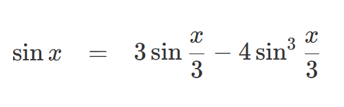

## 1.2 함수와 과정(함수가 생성하는)
> 전문 사진작가가 되려면 장면을 어떻게 바라봐야 할지, 다양한 노출 설정과 후처리 방법으로 사진을 인화했을 때 각 영역이 얼마나 어둡게 나올 것인지 등을 예측하는 방법을 배워야 한다.
> 그런 것들을 예측할 수 있어야 그로부터 거꾸로 추론해서 프레임, 조명, 노출, 인화 과정을 계획해서 원하는 효과를 얻을 수 있다.   
> 
> 전문적인 프로그래머가 되려면 다양한 종류의 함수가 생성하는 과정들을 시각화할 수 있어야 한다. 
> 원하는 행동을 보이는 프로그램을 안정적으로 구축하는 방법은 그런 능력을 갖추고 나서야 비로소 배울 수 있다.

## 1.2.1 선형 재귀와 반복
`n!` 계승(factorial)을 계산하는 두가지 방법

### 1. 선형 재귀적 과정
```js
function factorial(n) {
  return n === 1 ? 1 : n * factorial(n - 1);
}
```
```js
// 실행 과정 시각화
factorial(6)
6 * factorial(5)
6 * (5 * factorial(4))
6 * (5 * (4 * factorial(3)))
6 * (5 * (4 * (3 * factorial(2))))
6 * (5 * (4 * (3 * (2 * factorial(1)))))
6 * (5 * (4 * (3 * (2 * 1))))  // factorial(1) = 1 반환
6 * (5 * (4 * (3 * (2 * 1))))
6 * (5 * (4 * (3 * 2)))
6 * (5 * (4 * 6))
6 * (5 * 24)
6 * 120
720
```
- 입력 값이 크면 스택 오버플로우가 발생할 수 있다.

### 2. 선형 반복적 과정
```js
function factorial(n) {
  return fact_iter(1, 1, n);
}

function fact_iter(product, counter, max_count) {
  return counter > max_count
    ? product
    : fact_iter(counter * product, counter + 1, max_count);
}
```
```js
// 실행 과정 시각화
factorial(6)
fact_iter(1, 1, 6)   
fact_iter(1, 2, 6)   
fact_iter(2, 3, 6)   
fact_iter(6, 4, 6)   
fact_iter(24, 5, 6)  
fact_iter(120, 6, 6) 
fact_iter(720, 7, 6) 
720
```
- 선형 반복적 과정처럼 재귀적 함수로 서술되었지만 **반복적 과정을 고정된 크기 공간에서 실행**하는 구현을 꼬리 재귀적 구현이라고 부른다. 
- 꼬리 재귀는 오래전부터 알려진 컴파일러 최적화 요령 중 하나이다. **중간 결과를 누적하기 때문에 호출 스택을 쌓지 않고 다음 호출을 진행**한다.
- C, 자바, 파이썬 같은 프로그래밍 언어에서는 **함수가 소비하는 메모리와 함수 호출 횟수가 비례**해서 do, repeat, until, for, while 같은 **특별한 '루프 구조'로 반복적 과정을 서술**할 수 있다.

```
💡 자바스크립트에서는 ECMAScript 6(ES2015)에서 언어 명세에 꼬리 재귀 최적화를 포함했다.   
그러나 브라우저 중 Safari(webkit)만 꼬리 재귀 최적화를 구현하여 지원한다.

꼬리 재귀 최적화를 지원하지 않았을 때는 아래 두가지 이점을 얻을 수 있다.  
1. 스택 추적(stack trace) 가능
- 디버깅할 때 호출 경로와 중간 호출에 대한 정보를 알 수 있다. 
- 일반 재귀일 때 오류 메시지 
    `Error at factorial(1)
    at factorial(2)
    at factorial(3)
    at factorial(4)
    at factorial(5)`
- 꼬리 재귀 최적화 했을 때 오류 메시지
    `Error at factorial(1)`
2. 스택 깊이 제한 우회에 대한 안전 장치
- 자바스크립트는 무한 루프나 과도한 재귀를 방지하기 위한 스택 깊이 제한이 있다. 
- 꼬리 재귀는 무한 루프나 과도한 재귀에 걸리지 않고 무한히 실행할 수 있어서 CPU와 메모리 자원을 고갈시킬 수 있다.  

자바스크립트에서 꼬리 재귀 없이 반복적 과정을 구현할 수 있는 방법을 알아봤다. (아래 3, 4번)
```

### 3. 선형 반복적 과정을 while로 구현
```js
function factorial(n) {
  let product = 1;
  let counter = 1;

  while (counter <= n) {
    product *= counter;
    counter += 1;
  }

  return product;
}
```
- 명령형 프로그래밍. 상태 변경을 통해 계산

### 4. trampoline 패턴을 이용해서 구현
- 튀어오르기(함수 실행)와 착지하기(결과로 다른 함수 반환)를 반복하는 패턴
```js
// 함수 실행과 반환을 반복할 함수
function trampoline(fn) {
  return function(...args) {
    let result = fn(...args);
    while (typeof result === "function") {
      result = result();
    }
    return result;
  };
}

// trampoline으로 실행할 factorial 함수
function factorial(n, acc = 1) {
  if (n <= 1) return acc;
  return () => factorial(n - 1, n * acc);
}

const trampolinedFactorial = trampoline(factorial);
```

```js
// 실행 과정 시각화
trampolinedFactorial(6) 
→ factorial(6, 1)
→ () => factorial(5, 6) 반환
→ 이 함수 실행 → () => factorial(4, 30) 반환
→ 이 함수 실행 → () => factorial(3, 120) 반환
→ 이 함수 실행 → () => factorial(2, 360) 반환
→ 이 함수 실행 → () => factorial(1, 720) 반환
→ 이 함수 실행 → 720 반환
```
- trampoline으로 실행한 함수가 함수를 결과로 반환하면 다시 함수를 실행해서 함수가 아닌 결과가 나올 때 까지 반복한다.
- 함수형 프로그래밍. 상태를 누적(acc) 인자로 전달해서 계산

```
💡 trampoline 패턴은 자바스크립트에서도 함수형 방식으로 꼬리 재귀를 구현할 수 있지만 나머지 방식보다 가독성은 떨어져 보인다.
최적화가 중요하고 side effect가 없어야 하는 큰 단위 작업에서 유용하게 쓸 수 있을 것 같다.
```

### 연습문제 1.9 plus(a, b) 함수 생성 과정을 치환 모형으로 표현하기
> 다음 두 함수는 주어진 인수를 1 증가하는 함수 inc와 1 감소하는 함수 dec를 이용해서 두 양의 정수의 덧셈을 구현한다.
> `plus(4, 5)`를 평가할 때 각 함수가 생성하는 과정을 치환 모형으로 표현하라. 이 과정들은 반복적인가, 아니면 재귀적인가?

```js
// 재귀적
function plus(a, b) {
  return a === 0 ? b : inc(plus(dec(a), b));
}

// 과정 - 계산이 끝날 때까지 지연된 계산들을 저장함
plus(4, 5);
inc(plus(dec(4), 5));
inc(plus(3, 5));
inc(inc(plus(dec(3), 5)));
inc(inc(plus(2, 5)));
inc(inc(inc(plus(dec(2), 5))));
inc(inc(inc(plus(1, 5))));
inc(inc(inc(inc(plus(dec(1), 5)))));
inc(inc(inc(inc(plus(0, 5)))));
inc(inc(inc(inc(5))));
inc(inc(inc(6)));
inc(inc(7));
inc(8);
9;
```
```js
// 반복적
function plus(a, b) {
  return a === 0 ? b : plus(dec(a), inc(b));
}

// 과정 - 상태가 매 실행마다 담겨있음. 지연된 계산이 없음
plus(4, 5)
plus(dec(4), inc(5));
plus(3, 6);
plus(dec(3), inc(6));
plus(2, 7);
plus(dec(2), inc(7));
plus(1, 8);
plus(dec(1), inc(8));
plus(0, 9);
9;
```

### 연습문제 1.10 애커만 함수
> 다음 함수는 애커만 함수라고 부르는 수학 함수를 계산한다.

```js
function A(x, y) {
  return y === 0 
    ? 0
    : x === 0
    ? 2 * y
    : y === 1
    ? 2
    : A(x - 1, A(x, y - 1));    
}
```
> 다음 문장들은 각각 어떤 값으로 평가되는가?

```js
// 1번 문제 - 결과: 1024
// - 2^10: 아래 g(n) 함수 참고
A(1, 10); 


// 2번 문제 - 결과: 65,536
// - 2^(2^(2^(2))) 아래 h(n) 함수 참고
A(2, 4); 

// 전개 과정
4 === 0 // y는 0 아님
  ? 0
  : 2 === 0 // x는 0 아님
    ? 2 * y
    : 4 === 1 // y는 1 아님
      ? 2
      : A(2 - 1, A(2, 4 - 1)); // 실행

A(2 - 1, A(2, 4 - 1));
A(1, A(2, 3));
A(1, A(2 - 1, A(2, 3 - 1)));
A(1, A(1, A(2, 2)));
A(1, A(1, A(2 - 1, A(2, 2 - 1))));
A(1, A(1, A(1, A(2, 1))));
A(1, A(1, A(1, 2)));
A(1, A(1, A(1 - 1, A(1, 2 - 1))));
A(1, A(1, A(0, A(1, 1))));
A(1, A(1, A(0, 2)));
A(1, A(1, 4));
A(1, A(1 - 1, A(1, 4 - 1)));
A(1, A(0, A(1, 3)));
A(1, A(0, A(1 - 1, A(1, 3 - 1))));
A(1, A(0, A(0, A(1, 2))));
A(1, A(0, A(0, A(1 - 1, A(1, 2 - 1)))));
A(1, A(0, A(0, A(0, A(1, 1)))));
A(1, A(0, A(0, A(0, 2))));
A(1, A(0, A(0, 4)));
A(1, A(0, 8));
A(1, 16);
A(1 - 1, A(1, 16 - 1));
A(0, A(1, 15));
A(0, A(1 - 1, A(1, 15 - 1)));
A(0, A(0, A(1, 14)));
A(0, A(1 - 1, A(1, 14 - 1)));
A(0, A(0, A(1, 13)));
A(0, A(0, A(1 - 1, A(1, 13 - 1))));
A(0, A(0, A(0, A(1, 12))));
// ... 계속 중첩 계산되면서 결과값이 크게 증가함
```


> 양의 정수 n에 대해 f, g, h가 계산하는 함수를 각각 간결한 수식으로 표현하라.
```js
function A(x, y) {
  return y === 0 ? 0 : 
    x === 0 ? 2 * y : 
    y === 1 ? 2 : 
    A(x - 1, A(x, y - 1));    
}

// 수식: 2 * n
// A 함수는 x가 0일 경우 항상 2 * y를 반환함
// y가 0일 경우 2 * 0은 0이므로 y === 0 ? 0에 일치함
function f(n) {
  return A(0, n);
}

// 수식: 2^n
// y가 0이면 0, y가 1이면 2, 그 외에는 `A(1 - 1, A(1, y - 1))` 반환
// A(0, A(1, y - 1))에서 A(1, y - 1) 부분은 x가 1이라서 2의 n제곱 형태로 값이 늘어남
// - `A(1, 1) = 2`
// - `A(1, 2) = A(0, A(1, 1)) = A(0, 2) = 4`
// - `A(1, 3) = A(0, A(1, 2)) = A(0, 4) = 8`
// - `A(1, 4) = A(0, A(1, 3)) = A(0, 8) = 16`
function g(n) {
  return A(1, n);
}

// 수식: 2^(2^(2^(...))) (n만큼 2를 중첩)
// y가 0이면 0, y가 1이면 2, 그 외에는 `A(2 - 1, A(2, y - 1))` 반환
// A(1, A(2, y - 1))에서 A(1, y)는 2^n을 반환하고 A(2, y - 1)는 다시 A(1, A(2, y - 1))를 반환하므로
// A(1, A(2, y - 1))는 2^(2^(2^(...))) 형태가 된다.
function h(n) {
  return A(2, n);
}
```

## 1.2.2 트리 재귀
- 피보나치 수열을 계산하는 두가지 방법

### 1. 트리 재귀적 과정
```js
function fib(n) {
  return n === 0
    ? 0
    : n=== 1
    ? 1 
    : fib(n - 1) + fib(n - 2);
}
```
- fib가 한번 호출될 때마다 또 다른 두 fib 호출이 발생한다. 
- n을 줄여가며 같은 작업을 반복한다. 중복 계산하는 말단 노드(`fib(1)`, `fib(0)`) 개수는 `fib(n + 1)`이다.
- `fib(n)`은 `ϕⁿ/ √5`에 가장 가까운 정수인데 `ϕ² = ϕ + 1`이다. 
  - n이 올라갈 때 마다 `fib(n + 1)` 만큼이나 계산을 한다는 건 `fib(n²)`과 유사한 만큼 계산을 더 하는 거고, 지수적으로 계산이 증가한다는 의미이다.


### 2. 반복적 과정
```js
function fib(n) {
  return fib_iter(1, 0, n);
}

function fib_iter(a, b, count) {
  return count === 0
    ? b
    : fib_iter(a + b, a, count -1);
}

// 이해하기 쉽게 변수명 변경
function fib_iter(next, curr, remaining) {
  return remaining === 0
    ? curr
    : fib_iter(curr + next, next, remaining - 1);
}
```
- 필요한 단계의 수는 n에 선형으로 비례한다.                                     


### 연습문제 1.11

> 만일 `n < 3`이면 `f(n) = n`이고 만일 `n >= 3`이면 `f(n) = f(n - 1) + 2f(n - 2) + 3f(n - 3)`으로 정의되는 함수 f가 있다.  
> 재귀적 과정으로 f를 계산하는 자바스크립트 함수를 작성하라.   
> 반복적 과정으로 f를 계산하는 자바스크립트 함수를 작성하라.

#### 재귀적 과정
```js
function recursive(n) {
  return n < 3 
    ? n
    : recursive(n - 1) + (2 * recursive(n - 2)) + (3 * recursive(n - 3));
}
```

#### 반복적 과정
```js
function iterative(n) {
  return n < 3
    ? n 
    : iter(2, 1, 0, n - 2); //  f(2)까지 계산해서 시작하므로 count에서 2를 제외한다.
}

function iter(a, b, c, n) {
  return n === 0
    ? a
    : iter(a + (2 * b) + (3 * c), a, b, n - 1);
}
```
- a, b, c 각 인자를 `f(n - 1)`, `2f(n - 2)`, `3f(n - 3)`로 사용한다. 
  - 반복할 때 마다 `n - 1`에 해당하는 a에 새로운 계산 값을 넣고 나머지는 이전 값(b, c 자리)으로 옮긴다.


### 연습문제 1.12
> 파스칼의 삼각형을 재귀적 과정으로 계산하는 함수를 작성하라

```js
function pascals(x, y) {
  if (x > y) return 0;
  
  if (x === 1 || x === y) {
    return 1;
  }
  
  return pascals(x - 1, y - 1) + pascals(x, y - 1);
}
```

### 연습문제 1.13
> `Fib(n)`이 `ϕⁿ/ √5`에 가장 가까운 정수임을 증명하라  
> 힌트: 귀납법과 피보나치 수열의 정의를 이용해서 `Fib(n) = ϕⁿ- ψⁿ/ √5`을 먼저 증명해볼 것


## 1.2.3 증가 차수
- 증가 차수: 입력이 커질 수록 요구되는 자원의 양을 대략적으로 측정한 값  
- 필요한 자원 양을 `R(n)`, `R(n)`의 증가 차수를 `Θ(f(n))`라고 말한다. (`Θ`는 세타라고 읽는다.)
  - `R(n)` = `Θ(f(n))`

### 연습문제 1.14 
> 잔돈 11센트를 만드는 문제를 count_change 함수가 생성하는 과정을 트리로 표시하라.   
잔돈 금액 증가에 따른 공간 및 단계 수의 증가 차수는 무엇인가?

```js
function count_change(amount) {
    return cc(amount, 5);
}

function cc(amount, kinds_of_coins) {
    return amount === 0
           ? 1
           : amount < 0 || kinds_of_coins === 0
           ? 0
           : cc(amount, kinds_of_coins - 1)
             +
             cc(amount - first_denomination(kinds_of_coins),
                kinds_of_coins);
}

function first_denomination(kinds_of_coins) {
    return kinds_of_coins === 1 ? 1
         : kinds_of_coins === 2 ? 5
         : kinds_of_coins === 3 ? 10
         : kinds_of_coins === 4 ? 25
         : kinds_of_coins === 5 ? 50
         : 0;   
}
```


- 공간 복잡도: `Θ(n)`
  - 각 트리 계산 시점에 메모리에 유지되는건 한 경로 뿐이다.
  - 트리 최대 깊이는 amount(n)에 비례한다.

- 시간 복잡도: `Θ(n^k)`
  - amount(n)와 kinds_of_coins(k)에 따라 지수적으로 증가한다.
  - 각 동전 종류마다 amount까지 모든 깊이를 확인하므로 `Θ(n^k)`

- `cc(amount, kinds_of_coins - 1)`: **현재 금액을 유지**하고 동전 종류만 줄임
  - kinds_of_coins 종류가 늘어날 수록 **너비**(width)가 넓어진다.
  - kinds_of_coins이 하나씩 줄어들 때마다 amount를 줄여가며 amount가 없어질 때까지 계산한다.
- `cc(amount - coin, kinds_of_coins)`: 현재 동전으로 금액을 줄이고 **동전 종류는 유지**
  - amount 값이 커질 수록 **깊이**(depth)가 깊어진다.
  - k개 동전을 amount 깊이까지 계산 
- k개 가지가 n만큼 뻗어나간다.

### 연습문제 1.15
> 주어진 각도(라디안 단위)의 사인값을 계산한다고 하자.   
> 한 가지 방법은, 만일 x가 충분히 작다면 근사적으로 `sin x ≈ x`(sin x는 x와 거의 같다) 라는 점과 
> 다음과 같은 삼각함수 항등식을 이용해서 사인의 인수 x의 크기를 줄일 수 있다는 점을 이용하는 것이다.



> 이 연습 문제의 목적에서는, 각도의 크기(절댓값)가 0.1라디안보다 크지 않다면 "충분히 작은" 것으로 간주한다.)  
> 다음은 이러한 착안을 그대로 옮긴 자바스크립트 함수들이다.

```js
function abs(x) {
  return x >= 0 ? x : - x;
}

function cube(x) {
  return x * x * x;
}
function p(x) {
  return 3 * x - 4 * cube(x);
}
function sine(angle) {
  return ! (abs(angle) > 0.1) 
          ? angle // 각도(라디안) 절댓값이 0.1 라디안보다 작으면 각도를 그대로 반환
          : p(sine(angle / 3)); // 아니면 0.1보다 작아질 때 까지 각도를 계속 줄인 다음에 역계산
}
```

> 문제 a. sine(12.15)를 평가할 때 함수 p가 몇 번이나 적용되는가?
```js
// sine 함수에 넘기는 각도가 0.1라디안보다 작아질 때까지 실행
sine(12.15);
p(sine(4.05)) // 12.15 / 3
p(p(sine(1.35))); // 4.05 / 3
p(p(p(sine(0.45)))); // 1.35 / 3
p(p(p(p(sine(0.15))))); // 0.45 / 3
p(p(p(p(p(sine(0.05)))))); // 0.15 / 3

/* 정답: 5번 */
```


> 문제 b. sine(a)를 평가할 때 sine 함수가 생성하는 과정에 쓰이는 공간과 단계 수의 증가 차수(a의 함수로서의)는 무엇인가?
- 각 재귀 단계마다 하나의 p(sine(a)) 함수 호출
- 필요한 단계 수는 a를 3으로 나누어야 하는 횟수
- 역으로는 3을 몇번 곱해야 n이 되는지로 계산할 수 있으므로 `log₃(a)`
- 공간과 단계 수의 증가 차수는 `Θ(log a)`

## 1.2.4 거듭제곱
> 연속 제곱을 이용하면 거듭제곱에 필요한 단계수를 줄일 수 있다.

```js
function fast_expt(b, n) {
  return n === 0
          ? 1
          : is_even(n)
                  ? square(fast_expt(b, n / 2)) // 짝수: 2로 나누어서 연속 제곱으로 만들기
                  : b * fast_expt(b, n - 1); // 홀수: 짝수로 만들어서 계산
}
```
- 연속 제곱 이용 전 단계 수: `Θ(n)`
- 연속 제곱 이용 후 단계 수: `Θ(log n)`

### 연습문제 1.16
> 또 다른 상태 변수 a를 추가해서 한 상태에서 다음 상태로 넘어가도 곱 abⁿ은 변하지 않도록 공식을 고안할 것  
> a * bⁿ= constant
> 과정의 시작에서 a가 1로 출발한다면, 과정이 끝났을 때 a의 값이 곧 최종적인 거듭제곱 답이다.  
> 일반적으로, 반복적 알고리즘의 설계를 고민할 때는 상태가 바뀌어도 변하지 않는 불변량

```js
function fast_expt_iter(a, b, n){
    return n === 0
           ? a
           : is_even(n)
           ? fast_expt_iter(a, b * b, n / 2) // 짝수: b를 제곱하고 n을 절반으로 줄이면 곱셈 연산을 줄일 수 있음
           : fast_expt_iter(a * b, b, n - 1); // 홀수: a = a*b로 갱신하고, n을 1 줄여서 짝수로 만듦
}

function fast_expt(b, n){
    return fast_expt_iter(1, b, n);
}
```
- 위 fast_expt와 다르게 추가 스택 공간 없이 동작할 수 있음 
  - 꼬리재귀 최적화가 되어있는 경우에만 새로운 스택 프레임 생성하는 대신 현재 프레임 재사용함

### 연습문제 1.17
> 덧셈을 되풀이해서 정수 곱셈을 수행하는 함수를 구현하라.  
> double 함수와 halve 함수를 이용해서 단계 수가 fast_expt처럼 로그인 함수를 구현하라.  
> 언어가 곱셈은 지원하지 않고 덧셈만 지원한다고 가정한다.


```js
function double(x) {
  return x + x;
}

function halve(x) {
  return x / 2;
}

function fast_times(a, b) {
  return b === 1
        ? a
        : a === 0 || b === 0
        ? 0 
        :is_even(b)
        ? double(fast_times(a, halve(b)))  // 짝수: 더해야하는 횟수를 반으로 줄이고 누적 값(a)을 두배로 만든다. 
        : a + fast_times(a, b - 1); // 홀수: 더해야하는 횟수를 한 번 빼고 누적값에 a를 한 번 더한다.
}
```

### 연습문제 1.18
> [연습문제 1.16]과 [연습문제 1.17] 결과를 이용해서, 두 정수를 덧셈, 두배, 절반 연산으로 곱하되 단계 수가 로그인 반복적 과정을 생성하는 함수를 고안하라.
```js
function fast_times_iter(a, b, acc) {
  if (b === 0) return acc;
  
  return is_even(b)
  ? fast_times_iter(double(a), halve(b), acc) // 짝수: 더해야할 값을 두배로 만들고 더해야할 횟수를 반으로 만든다.
  : fast_times_iter(a, b - 1, acc + a); // 홀수: 더해야하는 횟수를 한 번 빼고 a를 누적값에 더한다.
}

function fast_times(a, b) {
  return fast_times_iter(a, b, 0);
}
```
- 불변량 유지: 매 호출마다 `a * b + acc` 값이 일정하다.

### 연습문제 1.19
> 피보나치 수열을 로그 단계 수로 계산하는 함수를 완성하라. 
> 1.2.2 반복적 과정의 `fib_iter` 함수에서는 상태 변수 a와 b가 변환𝑇 (즉, `a ← a + b, b ← a`)를 반복적으로 적용해서 피보나치 수를 생성한다.  
> 이 변환𝑇를 p = 0, q = 1인 특수 사례 𝑇𝑝,𝑞로 확장한다. 𝑇𝑝,𝑞는 상태 (a, b)를 다음과 같이 변환한다.  
> - `a ← bq + aq + ap, b ← bp + aq`
> 1. 변환 𝑇𝑝,𝑞를 두 번 적용한 것이 𝑇𝑝′,𝑞′로 동일하게 나타낼 수 있음을 증명
> 2. 조건을 만족하는 p′, q′를 p, q에 관한 식으로 표현
> 3. 빠른 거듭제곱을 이용해 𝑇를 n번 적용하는 계산을 로그 단계로 계산하는 알고리즘 완성

#### 증명을 위한 전개
- p = 0, q = 1인 경우 `a ← bq + aq + ap`, `b ← bp + aq` => `a ← b*1 + a*1 + a*0`, `b ← b*0 + a*1` => `a ← b + a`, `b ← a` => 피보나치 기본 변환𝑇와 동일함
- 𝑇𝑝,𝑞를 한 번 적용하면 `a₁ = (b * q) + (a * (q + p))`, `b₁ = (b * p) + (a * q)`;
- 𝑇𝑝,𝑞를 두 번 적용하면 `a₂ = (b₁ * q) + (a₁ * (q + p))`, `b₂ = (b₁ * p) + (a₁ * q)`;
  - `a₂ = ((b * p) + (a * q) * q) + (((b * q) + (a * (q + p))) * (q + p))`
    - 첫번째 항: `((b * p) + (a * q) * q) = bpq + aq²`
    - 두번째 항: `(((b * q) + (a * (q + p))) * (q + p)) = (bq + aq + ap) * (q + p) = bq² + aq² + apq + bpq + apq + ap² = 2apq + aq²+ ap² + bpq + bq²`
    - 전개: `bpq + aq² + 2apq + aq²+ ap² + bpq + bq² = 2apq + 2bpq + 2aq² + ap² + bq²`
    - a와 b로 정리: `a(2pq + 2q² + p²) + b(2pq + q²)`
  - `b₂ = (((b * p) + (a * q)) * p) + (((b * q) + (a * (q + p))) * q)`
    - 첫번째 항: `(((b * p) + (a * q)) * p) = bp² + apq`
    - 두번째 항: `(((b * q) + (a * (q + p))) * q) = (bq + aq + ap) * q = bq² + aq² + apq`
    - 전개: `bp² + apq + bq² + aq² + apq = 2apq + aq² + bp² + bq²`
    - a와 b로 정리: `a(2pq + q²) + b(p² + q²)`
#### 두 번의 변환을 한 번의 변환으로 나타내면 `p' = q² + p²`, `q' = 2pq + q²`
  - 𝑇𝑝',𝑞'가 적용되었을 때 `a₂ = bq' + a(q' + p')`, `b₂ = bp' + aq'` 형태가 되어야 한다고 가정
  - a₂의 경우 `bq' + a(q' + p')`이므로
    - `bq' =  b(2pq + q²)` => `q'`는 `2pq + q²`
    - `a(q' + p')` => `q' + p'`는 `2pq + 2q² + p²`
    - `(q' + p') - q' = p'`
      - `p' = (2pq + 2q² + p²) - (2pq + q²)` => `p'`는 `q² + p²`
      - `q'`는 `2pq + q²`
  - b₂의 경우 `bp' + aq'`이므로
    - `bp' = b(p² + q²)` => `p'`는 `q² + p²`
    - `aq' = a(2pq + q²)`=> `q'`는 `2pq + q²`

```js
function is_even(n) {
    return n % 2 === 0;
}

function fib(n) {
    return fib_iter(1, 0, 0, 1, n);
}

function fib_iter(a, b, p, q, count) {
    return count === 0
           ? b
           : is_even(count)
           ? fib_iter(a,
                      b,
                      p * p + q * q, // `p'`는 `q² + p²`
                      2 * p * q + q * q, // `q'`는 `2pq + q²`
                      count / 2)
           : fib_iter(b * q + a * q + a * p, // 문제에서 알려준 식
                      b * p + a * q,
                      p,
                      q,
                      count - 1);
}
```


## 1.2.5 최대공약수
> 두 정수 a와 b의 최대공약수는 a와 b 모두와 나누어 떨어지는 가장 큰 정수이다.
 
### 최대공약수를 찾는 효율적인 알고리즘 (유클리드 호제법)
> a를 b로 나눈 나머지가 r이라고 할 때 a와 b의 공약수들은 b와 r의 공약수들과 정확히 같다.    
> 이 방정식을 이용하면 두 정수 최대공약수를 구하는 문제를 더 작은 정수 쌍의 최대공약수를 구하는 문제로 줄여나갈 수 있다.
> - `GCD(a,b) = GCD(b,r)`

```js
// 축약 과정을 반복하다 보면 항상 둘째 수가 0인 쌍에 도달한다.
// GCD(206,40) = GCD(40,6) = GCD(6,4) = GCD(4,2) = GCD(2,0) = 2

function gcd(a, b){
  return b === 0 ? a : gcd(b, a % b);
}
```
- 과정의 단계 수는 로그로 증가한다.

### 연습문제 1.20
> gcd 함수를 정상 순서 평가로 해석한다고 가정한다. `gcd(206, 40)` 평가로 생성되는 과정을 치환 모형을 이용해서 묘사하되,
> 실제로 수행된 `나머지` 연산들을 표시하라. `나머지` 연산을 몇번이나 수행하는가? 인수 우선 평가에서는 몇 번인가?

#### 정상 순서 평가: 18번
```js
gcd(206, 40)

return 40 === 0 ? 206 : gcd(40, 206 % 40);
// 6 === 0 ? 에서 1번
return 206 % 40 === 0 ? 40 : gcd(206 % 40, 40 % (206 % 40)) 
// 4 === 0 ? 에서 2번
return 40 % (206 % 40) === 0 ? 206 % 40 : gcd(40 % (206 % 40), (206 % 40) % (40 % (206 % 40))) 
// 2 === 0 ? 에서 4번
return (206 % 40) % (40 % (206 % 40)) === 0 ? 40 % (206 % 40) : gcd((206 % 40) % (40 % (206 % 40)), (40 % (206 % 40) % ((206 % 40) % (40 % (206 % 40)))))
// 0 === 0 ? 에서 7번, a에서 4번
return 40 % (206 % 40) % ((206 % 40) % (40 % (206 % 40))) === 0 ? (206 % 40) % (40 % (206 % 40)): gcd((40 % (206 % 40) % ((206 % 40) % (40 % (206 % 40)))), ((206 % 40) % (40 % (206 % 40)) % (40 % (206 % 40) % ((206 % 40) % (40 % (206 % 40))))))

// 결과: 1 + 2 + 4 + 7 + 4 = 18번
```

#### 인수 우선 평가: 4번
```js
gcd(206, 40)

// gcd 인자 b 206 % 40에서 1번
return 40 === 0 ? 206 : gcd(40, 6);
// gcd 인자 b 40 % 6에서 1번
return 6 === 0 ? 40 : gcd(6, 4);
// gcd 인자 b 6 % 4에서 1번
return 4 === 0 ? 6 : gcd(4, 2);
// gcd 인자 b 4 % 2에서 1번
return 2 === 0 ? 4 : gcd(2, 0);
// 삼항 연산자 참이므로 귀결 표현식을 바로 반환하고 종료함
return 0 === 0 ? 2 : gcd(0, 2 % 0);

// 결과: 1 + 1 + 1 + 1 = 4번
```


## 1.2.6 예제: 소수 판정 

### 연습문제 1.21
> smallest_divisor 함수를 이용해서 199, 1999, 19999의 최소 약수를 각각 구하라
- 199, 1999, 7

### 연습문제 1.22
> 원시 함수 get_time은 아무 인수도 받지 않고 UTC 기준으로 1970년 1월 1일 00시 00분 00초로부터 흐른 밀리초의 개수를 돌려준다. 
> 다음 timed_prime_test는 인수로 주어진 정수 n을 화면에 출력한 후 그것이 소수인지 판정한다. 
> 만일 n이 소수이면 이 함수는 별표 세 개와 판정에 걸린 시간을 출력한다.

```js
function square(x) {
    return x * x;
}

function smallest_divisor(n) {
    return find_divisor(n, 2);
}
function find_divisor(n, test_divisor) {
    return square(test_divisor) > n
           ? n
           : divides(test_divisor, n)
           ? test_divisor
           : find_divisor(n, test_divisor + 1);
}
function divides(a, b) {
    return b % a === 0;
}

function is_prime(n) {
    return n === smallest_divisor(n);
}

function timed_prime_test(n) {
    display(n);
    return start_prime_test(n, get_time());
}

function start_prime_test(n, start_time) {
    return is_prime(n)
           ? report_prime(get_time() - start_time)
           : false;
}

function report_prime(elapsed_time) {
    display(" *** ");
    display(elapsed_time);
    return true;
}
```
> 위 함수를 이용해서, 주어진 구간의 연속된 홀수들의 소수성을 판정하는 함수 search_for_primes를 작성하라. 
> 그리고 그 함수를 이용해서 1,000 | 10,000 | 100,000 | 1,000,000 보다 큰 최소 소수 세 개씩 구하라. 
> 각 소수 판정에 걸린 시간을 확인하라. 결과는 프로그램 실행 시간이 계산 단계수에 비례한다는 개념과 부합하는가?

- 문제 예시 케이스에 대해서는 elapsed_time이 0,1 정도만 나옴
```js
function search_for_primes(start, count) {
  return count === 0 
    ? true
    : start % 2 === 0
    ? search_for_primes(start + 1, count)
    : timed_prime_test(start)
    ? search_for_primes(start + 2, count - 1)
    : search_for_primes(start + 2, count);
}
```